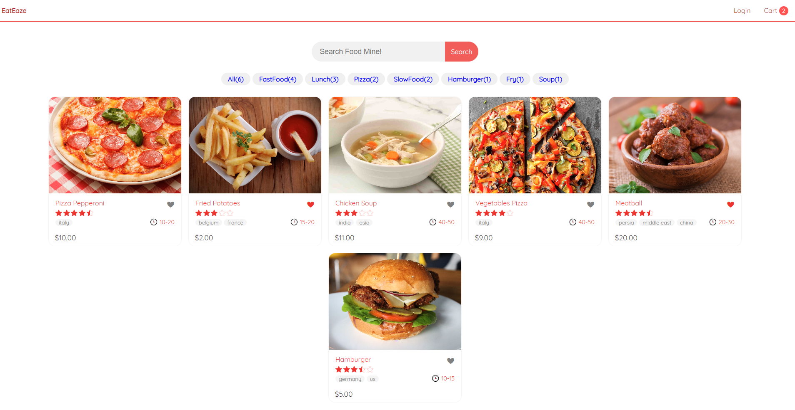
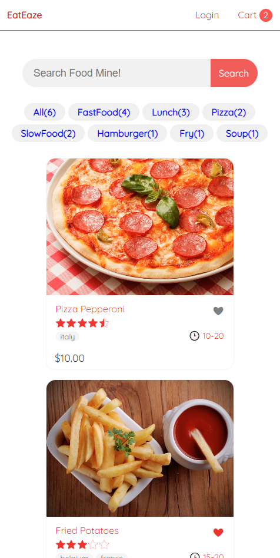
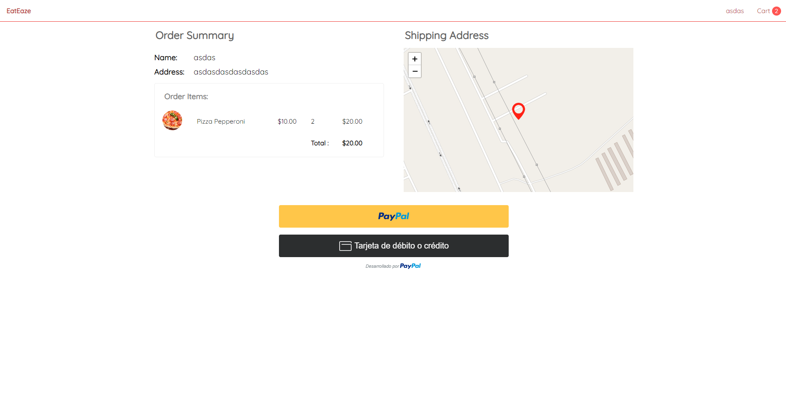

# **APP Eateaze**

## Tecnologías Utilizadas 🛠️:

 

 

## API 🌐:
      https://github.com/Jenzyy/api-eateaze

## Características de la Aplicación EatEaze 🍔🛒
- **Pagos en Línea Seguros:** EatEaze garantiza transacciones seguras al permitir que los usuarios completen sus pagos en línea mediante opciones confiables como PayPal y tarjetas de crédito.

- **Gestión de Sesiones Seguras:** Los usuarios pueden registrarse y acceder a sus cuentas de manera segura, lo que les permite realizar pedidos y acceder a su historial de compras a través de una autenticación basada en tokens JWT.

- **Exploración y Filtrado de Platos Deliciosos:** Los usuarios tienen la capacidad de explorar una amplia gama de platos deliciosos y utilizar opciones de filtrado por categorías para encontrar exactamente lo que están buscando.

- **Experiencia de Navegación Fluida y Responsiva:** La aplicación ofrece una experiencia de navegación fluida y se adapta a diferentes dispositivos y tamaños de pantalla, brindando una experiencia consistente en computadoras de escritorio, tabletas y dispositivos móviles.

- **Gestión Sencilla del Carrito de Compras:** Los usuarios pueden agregar o eliminar platos de su carrito de compras antes de finalizar sus pedidos, brindándoles un control total sobre su selección de productos.

-  

      
       

## **Limitaciones 🚫**:   
 La API de la aplicación está alojada en un servidor gratuito, lo que puede resultar en demoras y algunas interrupciones. Debido a las limitaciones de recursos, podría haber ocasionalmente fallas en la disponibilidad. 

